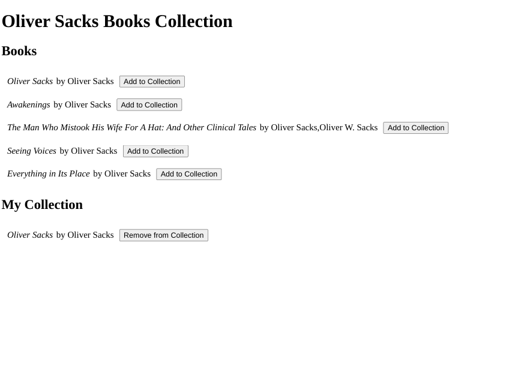

# NgRx Example

[NgRx documentation walkthrough tutorial](https://ngrx.io/guide/store/walkthrough) reworked to use ngrx effects.  

## Screenshots

## Link

[Live Link](https://jdegand.github.io/NgRx-example)

## Built With

- [Angular](https://angular.io)
- [Angular CLI](https://github.com/angular/angular-cli) version 16.0.1.
- [NgRx](https://ngrx.io/docs)

## Thoughts
   
- The main walkthrough tutorial takes a shortcut, and doesn't add effects, and just directly calls the service class in `app.component.ts`.
- I removed the direct call to the service and added ngrx effects.  
- My implementation could be improved.  An error action could be added for when the API request fails.    
- I went through the testing documentation, and it is slightly outdated, as the walkthrough was changed to use `createActionGroup` versus defining and exporting each action individually. You have to replace the imports of `onAdd` and `onRemove` with an import of `BooksActions`.  Then you call `BooksActions.onAdd` in place of `onAdd`.      

## Useful Resources

- [Concrete Page](https://www.concretepage.com/ngrx/ngrx-effects-example#download) - ngrx effects 
- [Dev.to](https://dev.to/this-is-angular/ngrx-tips-i-needed-in-the-beginning-4hno#create-reusable-reducers) - create reusable reducers
- [Dev.to](https://dev.to/ngrx/ngrx-action-group-creator-1deh) - action group creator
